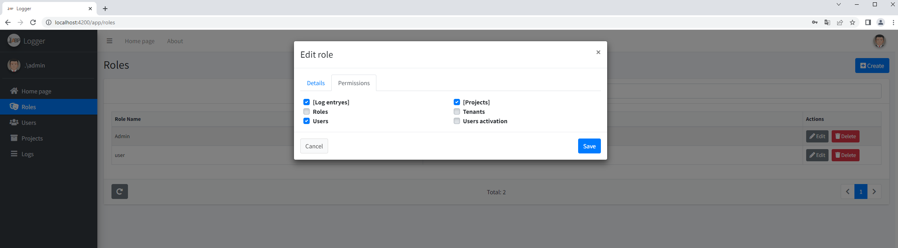
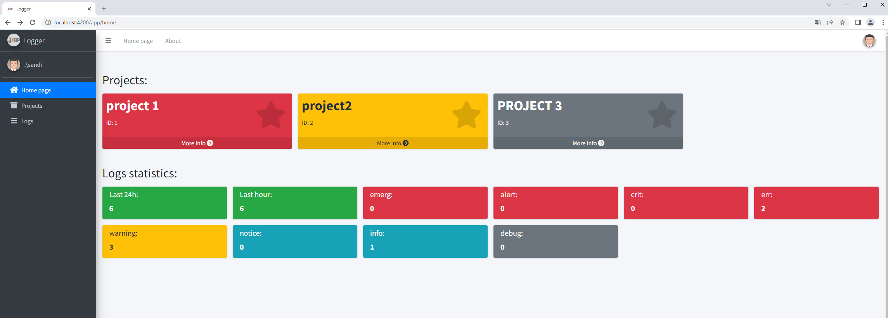

# LoggerWebApp
 
 -Build angular:
 go to angular dir and instal with npm-install or yarn
 
 -Create user role and give permissions user, logEntryes, and projects

-user can then log in and create projects from ui
-logs can be added from api, project id is needed

